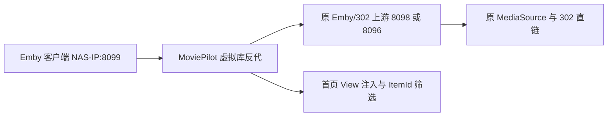

# 媒体虚拟库（MoviePilot v2）

版本：`4.0.0`  
作者：`Boss`  
插件类/市场键：`MediaArchiver`

这一版把展示方式从 Emby `Collection / BoxSet` 改为首页一级虚拟媒体库。`Remux专区`、`4K专区`、`Netflix · 电影榜` 等会像正常电影库一样出现在 Emby 首页，不再放进“合集”。

## 最重要的改变

- v4 同步过程不调用 `POST /Collections`，不新建、不写入 BoxSet。
- 插件在 MoviePilot 容器内启动一个轻量 Emby 反向代理，默认监听 `8099`。
- 客户端必须连接 `http://NAS-IP:8099` 才能看到首页虚拟库。
- 虚拟库内返回原 Emby `ItemId`，不创建第二份媒体 Item。
- 详情、海报、字幕、播放和 WebSocket 继续转发给配置的 Emby/302 上游。



## 安全边界

- 不移动、复制、重命名或删除 115/NAS 媒体文件。
- 不修改 Symedia 归档目录，不生成 STRM，不调用 CD2/WebDAV 文件操作。
- 不改写 Emby `MediaSources.Path`。
- 同一部电影在原媒体库和多个虚拟库中都使用同一个 `ItemId`。
- “清空 v3.x 旧合集成员”只移除旧 BoxSet 逻辑关联，不删除影片 Item 或文件。

## 功能

### 媒体属性虚拟库

| 虚拟库 | 主要判定 |
|---|---|
| Remux专区 | Emby Item、`MediaSources.Path`、文件名或媒体源信息中含 `Remux`，不区分大小写 |
| 4K专区 | 优先 `Width >= 3840` 或 `Height >= 2160`，再回退 `2160p`/`4K`/`UHD` |
| Dolby Vision专区 | 优先视频流 DV Profile/VideoRangeType/Profile/Codec，再回退 `Dolby Vision`/`DOVI`/`DVHE` |
| HDR专区 | 优先 HDR10/HDR10+/HLG/PQ/SMPTE2084/Dolby Vision 结构化字段 |
| Atmos专区 | 优先音频流 Title/Profile/Codec/CodecTag 中的 Atmos/JOC，再回退关键词 |

Dolby Vision 同时属于 HDR，因此同一 ItemId 可同时出现在两个虚拟库。多个 MediaSource 属于同一 Item 时，任一版本命中即算命中，但虚拟库中仍只返回一次 ItemId。

### 平台榜单虚拟库

配置页包含热门、Netflix、HBO、Apple TV+、Disney+、Crunchyroll、Amazon Prime、Amazon、Hulu、猫眼、豆瓣和腾讯视频 12 组选项。每个勾选项成为首页独立虚拟库，例如：

```text
Netflix · 电影榜
Netflix · 剧集榜
Disney+ · 混合榜
猫眼 · 电影榜
```

插件只显示“榜单上有，且当前 Emby 已入库”的影片。匹配优先级：

1. Emby `ProviderIds`：TMDB / IMDb / TVDB / AniList / Bangumi / Douban。
2. 无 ID 时使用规范化标题 + 年份严格回退。
3. 无年份时，只有当前 Emby 内该类型标题唯一才允许回退。

外部榜单源失败或返回 0 项时，保留上次虚拟库成员，不会误清空。

## 安装与 Docker 端口

仓库结构：

```text
MoviePilot-Plugins-Boss/
├── plugins.v2/
│   └── mediaarchiver/
│       └── __init__.py
├── icons/
│   └── folder-move.svg
├── package.v2.json
└── README.md
```

1. 替换 `plugins.v2/mediaarchiver/__init__.py`、根目录 `package.v2.json` 和 `README.md`。
2. 提交到 GitHub `main` 分支，在 MoviePilot 插件市场刷新并升级到 `4.0.0`。
3. 给 MoviePilot 容器增加 `8099` 端口映射，然后重新创建容器。

Docker Compose 示例：

```yaml
services:
  moviepilot:
    ports:
      - "3001:3001"
      - "8099:8099"
```

如果 MoviePilot 使用 `network_mode: host`，无需写 `ports`，但要确保 `8099` 未被占用。

## 傻瓜式配置

1. `Emby 302 服务器地址`：填作为上游的地址。
   - 已有 302 反代：填 `http://上游容器名:8098` 或 `http://NAS-IP:8098`。
   - 仅用原生 Emby：填 `http://emby:8096`，但播放就是原生链路，不会凭空获得 302。
2. 填写 Emby API Key。
3. 保持“启用首页一级虚拟库（不放入合集）”开启。
4. 虚拟库客户端端口保持 `8099`。
5. 勾选媒体属性专区和/或平台榜单，保存。
6. 点击“测试连接”，再点击“一键重建”。
7. Emby 客户端中新增或修改服务器地址为 `http://NAS-IP:8099`，重新进入首页。

> `8096`/`8098` 是上游，`8099` 是客户端入口。客户端仍直接连 8096 或 8098 时，不会经过插件的 View 注入，因此看不到首页虚拟库。

### 从 v3.x 升级

v4 不会再更新旧 BoxSet，但 v3.x 已写入的成员不会凭空消失。升级并确认首页虚拟库正常后：

1. 点击“清空 v3.x 旧合集成员”。
2. 该按钮只处理插件状态中已记录的 CollectionId，不删影片和文件。
3. Emby 中如仍看到空的 BoxSet，可在 Emby 合集管理页手动删除这些空壳。

## 全量、增量与删除清理

- **一键重建**：重新扫描 Emby 已入库 Movie/Series，计算每个虚拟库的 ItemId 集合。
- **Webhook 增量触发**：新增、更新、删除事件防抖 8 秒后合并处理。
- **定时校准**：默认每 60 分钟重新取榜单并校准，补偿 Webhook 漏报。
- **媒体删除/版本变化**：ItemId 已不存在或不再命中时，从虚拟库内存/持久成员表中移除。
- **取消勾选**：下次同步后不再向首页注入该虚拟库。

## 为什么不能直接放到 8096 首页

Emby 原生 `POST /Library/VirtualFolders` 创建的是带 `Paths` 的真实媒体库，需要扫描路径；如把原路径再挂一次，就可能产生第二份 Emby Item，违反“原 ItemId + 原 302”的约束。

v4 采用与虚拟库反代常见实现相同的展示层方案：

- 向 `/Users/{UserId}/Views` 追加虚拟 `CollectionFolder`。
- 拦截虚拟 `ParentId` 的 `/Users/{UserId}/Items` 和 `/Items/Latest`。
- 根据已计算成员表查询原 ItemId，返回 Emby 上游的原始 Item JSON。
- 其余 API 原样透传，302 `Location` 不改写。

## API 使用说明

### MoviePilot v2

1. `_PluginBase`：配置、状态数据与插件生命周期。
2. `MediaServerHelper`：仅作旧版/高级多服务器扫描兼容。
3. `eventmanager.register(EventType.WebhookMessage)`：新增、更新、删除触发。
4. `get_service()` + APScheduler `IntervalTrigger`：定时校准。
5. `get_api()`：连接测试、重建、状态和旧合集清理。
6. `get_form()` / `get_page()`：傻瓜式配置、命中数、反代状态和折叠日志。

### Emby REST/Client API

| 方法 | 路径 | 用途 |
|---|---|---|
| GET | `/System/Info` | 验证上游地址/API Key，兼容 `/emby` 前缀 |
| GET | `/Items` | 分页扫描 Movie/Series 与媒体流字段 |
| GET | `/Items/{ItemId}` | 单项兼容读取 |
| GET | `/Users/{UserId}/Views` | 返回原视图并注入首页虚拟 `CollectionFolder` |
| GET | `/Users/{UserId}/Items` | 点击虚拟库后返回原 ItemId |
| GET | `/Users/{UserId}/Items/Latest` | 生成首页横向海报栏 |
| GET | `/Items/{VirtualId}/Images/Primary` | 使用首个命中影片海报作库封面 |
| 任意 | 其余 Emby API | 原样反代，包括 302 和 WebSocket |
| DELETE/POST | `/Collections/{id}/Items` | **仅**用户主动点击“清理 v3.x 旧合集”时移除旧关联 |

v4 的正常同步没有创建或添加 Collection 成员的 API。

## 验证方法

1. 在 Emby 原生 `8096` 或旧 302 `8098` 入口找到一部 Remux 影片，记录 ItemId。
2. 插件只启用 Remux专区，点“一键重建”。
3. 客户端改连 `NAS-IP:8099`，确认首页出现 Remux专区横向栏目。
4. 确认原华语/日韩/欧美/动画库仍有该影片。
5. 从原库和 Remux专区分别打开详情，确认 ItemId 一致。
6. 从 Remux专区播放，确认仍收到原 302 直链。
7. 到 Emby“合集”页检查：v4 不会新增 Remux/榜单 BoxSet。

## 故障排查

| 现象 | 检查 |
|---|---|
| 同步命中大于 0，首页没栏目 | 客户端是否连接 `NAS-IP:8099`，而不是 8096/8098 |
| `8099` 无法连接 | Docker 是否映射 `8099:8099`，端口是否被占用，插件页“首页虚拟库反代”是否绿色 |
| 首页有栏目但点开为空 | 先点“一键重建”，查看数据页的命中数和上游错误 |
| 能看到但无法播放 | 检查配置的上游 8098/8096 本身能否播放；插件不会自己生成 302 |
| 旧合集仍有内容 | 点“清空 v3.x 旧合集成员”，再刷新 Emby |
| 上游填 NAS 地址但容器连不上 | 改用同 Docker 网络的容器名，或使用容器可访问的 NAS 局域网 IP |

## 回归测试

本版离线伪 Emby 测试覆盖：

- 五类属性结构化判定与多版本去重。
- ProviderId 榜单匹配和外部源失败保留。
- `/Users/u/Views` 注入且不影响原媒体库。
- 虚拟 ParentId 分页、排序、`Items/Latest` 首页横向栏。
- 虚拟库详情和封面。
- 原 ItemId 返回和 302 `Location` 原样透传。
- v3.x 旧合集仅手动清理逻辑成员。
- 源码不包含 STRM/CD2/115 文件移动复制逻辑，不包含 Collection 创建/添加方法。

## 参考

- [MoviePilot V2 插件开发指南](https://github.com/jxxghp/MoviePilot-Plugins/blob/main/docs/V2_Plugin_Development.md)
- [Emby Items API](https://dev.emby.media/reference/RestAPI/ItemsService/getItems.html)
- [Emby VirtualFolders API](https://dev.emby.media/reference/RestAPI/LibraryStructureService/postLibraryVirtualfolders.html)
- [emby-virtual-lib 的视图注入方式](https://github.com/EkkoG/emby-virtual-lib)
- [TgtoDrive 公开仓库](https://github.com/walkingddd/TgtoDrive)
