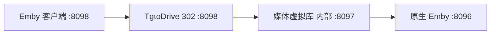

# 媒体虚拟库（MoviePilot v2）

当前版本：`4.2.0`　作者：`Boss`

把 Emby 已入库媒体按属性或平台榜单显示为首页一级虚拟库。插件不创建 Collection/BoxSet，不复制、不移动、不重命名媒体文件，也不改变 Symedia、115、STRM 或原媒体库目录。

## 8098 是唯一入口

客户端地址和 TgtoDrive 的 302 监听端口都保持：

```text
http://NAS-IP:8098
```

插件内部使用固定的 `8097` 注入 Emby 首页 View，但它只是 Docker 内网后端，不是第二个客户端入口，也不应映射到 NAS 公网端口。



这样安排的原因很直接：已经由 TgtoDrive 占用的 `IP:8098` 不能再被第二个进程重复监听。把 TgtoDrive 放在链路最外层，客户端仍只访问 8098，播放请求仍先经过 TgtoDrive 的 302 逻辑；插件只给普通 Emby 响应补充一级虚拟库。

## v4.2 修复内容

- 固定现有 `8098` 为唯一客户端和 302 播放入口，删除可配置的 8099/反代端口。
- 删除“启用首页一级虚拟库”和“启用动态封面”两个多余开关：一级库与封面是插件固定能力。
- 一级库封面始终输出 `960×540 PNG`；即使 MoviePilot 镜像没有 Pillow 或中文字库，也能由标准库生成，不再返回客户端兼容性较差的 SVG。
- `ImageTags.Primary` 改为 Emby 客户端兼容性更好的 32 位标签，成员数量变化会生成新标签并刷新封面。
- Apple TV+ 使用名称兼容和 TMDB Provider ID `350` 双重识别；其他平台也带稳定 ID 兜底。
- TMDB/榜单请求遇到 429、5xx、连接重置或超时会退避重试三次。
- 已勾选专区即使首次零命中或榜单源暂时失败，也保留一级库入口；已有成员不会因临时网络错误被误清空。
- 配置页只突出 Emby 地址、API Key、专区选择、自动维护和一键重建；低频参数收进“高级设置”。

## 功能

### 媒体属性专区

| 一级虚拟库 | 首选判定 | 回退判定 |
|---|---|---|
| Remux专区 | `MediaSources.Path`、媒体源名称/容器 | 文件名或媒体源文本包含 `Remux` |
| 4K专区 | 视频流 `Width >= 3840` 或 `Height >= 2160` | 分辨率文本包含 `2160p`/`4K` |
| Dolby Vision专区 | 视频流 `DVProfile`、`VideoRangeType` 等 | 文件名包含 `Dolby Vision`/`DoVi`/`DV` |
| HDR专区 | 视频流 HDR/HDR10+/HLG/PQ/DV 字段 | 文件名 HDR 关键词 |
| Atmos专区 | 音频流 `Title/Profile/Codec/CodecTag` | 文件名包含 `Atmos` |

同一 Emby `ItemId` 在同一专区只出现一次。多版本电影会检查该 Item 的全部 `MediaSources`：任一版本命中即可加入；所有版本都不再命中时才移除。

### 平台榜单一级库

保留热门、Netflix、HBO、Apple TV+、Disney+、Crunchyroll、Amazon Prime、Amazon、Hulu、猫眼、豆瓣、腾讯视频等选项。每个勾选项都是一个首页一级虚拟库，不会放入 Emby“合集”。

平台榜单只展示当前 Emby 已经入库并能通过 ProviderId 或标题年份匹配的媒体；插件不会下载榜单中缺失的影片。

### 动态封面

每个一级库都有独立识别色、英文标志、专区名称和实时命中数量。封面由插件本地生成，不依赖在线图片地址。空专区同样有封面并显示 `0 ITEMS`。

## 安装

仓库结构必须是：

```text
MoviePilot-Plugins-Boss/
├── icons/folder-move.svg
├── plugins.v2/mediaarchiver/__init__.py
├── package.v2.json
└── README.md
```

在 MoviePilot v2 添加仓库：

```text
https://github.com/ZangBanzi/MoviePilot-Plugins-Boss
```

刷新插件市场，安装或更新“媒体虚拟库”。更新后建议重启一次 MoviePilot，确保旧插件线程退出。

## 一次性链路配置

### 1. 让三个容器在同一 Docker 网络

MoviePilot、TgtoDrive 和 Emby 应加入同一个用户自定义网络，例如 `media-net`。MoviePilot 不需要增加 `8097:8097` 的主机端口映射。

```yaml
services:
  emby:
    networks: [media-net]

  moviepilot:
    networks: [media-net]

  tgtodrive:
    ports:
      - "8098:8098"
    networks: [media-net]

networks:
  media-net:
    name: media-net
```

### 2. 配置插件

插件首页只需先完成这些操作：

1. “原生 Emby 内网地址”填写 `http://emby:8096`。这里必须是 8098 背后的原生 Emby，不能填现有 8098，否则会形成请求循环。
2. 填写 Emby API Key，保存。
3. 点击“测试连接”。
4. 勾选需要的媒体属性专区和平台榜单。
5. 保持“自动维护新增与删除”开启，点击“一键重建”。

### 3. 保持 TgtoDrive 对外 8098，只改内部上游

TgtoDrive 的监听端口仍是 `8098`，主机映射仍是 `8098:8098`，客户端地址也完全不改。只把 TgtoDrive 配置里的 Emby 上游地址改为：

```text
http://moviepilot:8097
```

如果 MoviePilot 与 TgtoDrive 都使用 `network_mode: host`，内部上游可写：

```text
http://127.0.0.1:8097
```

这是链路内部指向，不是让用户访问 8097。不要把 8097 映射到公网，也不要把插件的“原生 Emby 内网地址”填成 8098。

## 全量与增量同步

- “一键重建”会重新扫描 Emby 的 Movie/Series、重算全部已启用规则并更新内存与持久状态。
- 自动维护会接收 MoviePilot 的 Emby Webhook 事件，防抖后做差异校准。
- 定时任务按配置周期补偿漏掉的事件。
- 新增媒体会自动加入命中的一级库。
- 删除、版本变化或属性消失后，会从对应一级库移除原 ItemId。
- 榜单源失败时保留上次成功成员；不会因一次连接重置清空专区。

## 为什么不影响原媒体库和 302

虚拟库只是对 Emby `Users/{UserId}/Views` 的返回追加合成 View，并在以虚拟 `ParentId` 查询时返回原媒体 Item。插件从不创建第二个媒体条目，也不修改原 Item 的路径。

- 原华语电影、欧美电影、动画电影等媒体库不变。
- 虚拟库列表里的电影仍是原 `ItemId`。
- 详情、海报和播放所需的原媒体字段来自 Emby 原响应。
- 未由插件处理的 API 请求会原样转发。
- TgtoDrive 位于最外层 8098，因此播放仍先走其已有 302 规则；插件不生成也不改写媒体直链。

## 使用的接口

### MoviePilot v2

- `_PluginBase`：插件生命周期、配置、状态持久化和 API 暴露。
- `MediaServerHelper`：兼容读取 MoviePilot 已配置的 Emby（可选高级功能）。
- `eventmanager.register(EventType.WebhookMessage)`：新增、更新、删除事件触发增量校准。
- `get_command()` / `get_service()`：手动重建和周期任务。
- `get_form()` / `get_page()` / `get_api()`：配置页、状态页、连接测试、重建与旧合集清理。

### Emby API

| 方法 | 路径 | 用途 |
|---|---|---|
| GET | `/System/Info` | 测试连接 |
| GET | `/Items` 或 `/Users/{UserId}/Items` | 分页扫描及按原 ItemId 读取媒体 |
| GET | `/Users/{UserId}/Views` | 注入首页一级虚拟库 |
| GET | `/Users/{UserId}/Items?ParentId={VirtualId}` | 返回虚拟库中的原 Item |
| GET | `/Users/{UserId}/Items/Latest?ParentId={VirtualId}` | 返回虚拟库最新项目 |
| GET | `/Items/{VirtualId}` | 返回一级虚拟库详情 |
| GET | `/Items/{VirtualId}/Images/Primary` | 返回动态 PNG 封面 |
| 任意 | 其他 API、WebSocket、播放请求 | 原样转发 |

正常同步不会调用 `POST /Collections`，实现采用展示层虚拟 `CollectionFolder`，不是 Collection/BoxSet。配置页的“清空 v3.x 旧合集成员”只用于用户主动清理旧版本遗留内容。

## 验证 Remux 同时存在于原库和一级虚拟库

1. 在原生 Emby 中找一部路径或文件名含 `Remux` 的电影，记下其 ItemId。
2. 在插件中启用 Remux专区并点击“一键重建”。
3. 客户端继续使用 `http://NAS-IP:8098`，重新进入首页；确认出现带动态封面的 Remux专区。
4. 打开 Remux专区找到该电影，再从原华语/欧美等电影库找到同一电影。
5. 对比详情请求，两个入口应返回同一 ItemId，而不是两份媒体。
6. 播放并检查 TgtoDrive 日志，确认请求仍进入 8098 的既有 302 流程。

## 故障排查

| 现象 | 检查内容 |
|---|---|
| 日志显示内部链路已启动，但 8098 看不到一级库 | TgtoDrive 的 Emby 上游是否为 `http://moviepilot:8097`；三容器是否在同一网络；客户端是否仍连 8098 |
| 插件拒绝原生 Emby 地址 | 插件地址是否误填成 8098；应填写 `http://emby:8096` |
| Apple TV+ 提示未找到 Provider | 确认已升级到 4.2.0；该版会用 Provider ID 350 兜底 |
| Disney+ 等出现 Connection reset | 4.2.0 会自动重试；临时失败会保留上次成员和一级库入口 |
| 一级库仍显示灰色默认图 | 重启 MoviePilot 与 TgtoDrive，退出后重新进入 Emby 客户端；必要时清理客户端图片缓存，确认请求经过 8098 链路 |
| 专区存在但为 0 项 | 这是已选专区的正常占位；检查媒体结构化字段、文件名和 ProviderIds |
| 能浏览但无法播放 | 先验证原 8098 的 TgtoDrive 配置；插件不会改写原 ItemId、MediaSource 或 302 规则 |

## 离线回归测试

仓库根目录执行：

```bash
python test_mediaarchiver.py
python test_virtual_library.py
```

测试覆盖：首页 View 注入、空专区保留、属性与榜单匹配、分页、Latest、详情、32 位封面标签、无 Pillow PNG 回退、ETag、原 ItemId、302 透传、多次同步去重和删除清理。
