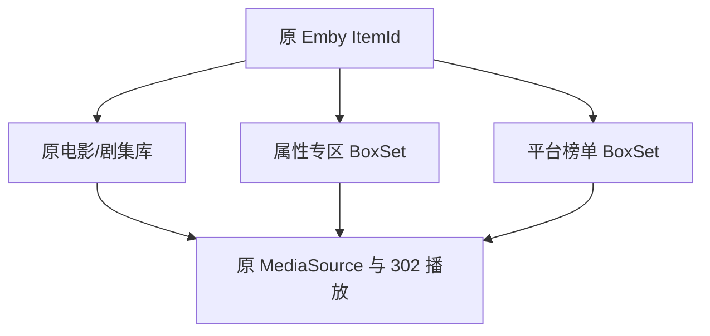

# 媒体虚拟库（MoviePilot v2）

版本：`3.2.1`  
作者：`Boss`  
插件类/市场键：`MediaArchiver`

本版在原有五个“媒体属性专区”和平台榜单虚拟库能力上，把配置页改成 TgtoDrive 风格的直连与傻瓜式操作：填写 Emby 302 服务器地址、API Key，勾选功能后保存即可。平台榜单中已经存在于当前 Emby 的影片会投射成独立 `Collection / BoxSet`。

这是独立实现，不依赖 TgtoDrive。按需求明确不加入截图中的“榜单合集内容”、IMDb Top 250、奖项梯队、Letterboxd 片单等固定策展合集。

## 最重要的安全边界

- 不移动、不复制、不重命名、不删除 115 或 NAS 上的任何媒体文件。
- 不修改 Symedia 归档目录，不生成新 STRM，不调用 CD2/WebDAV 文件操作。
- 只把原 Emby `ItemId` 加入一个或多个 BoxSet。
- 原影片仍在华语、日韩、欧美、动画等原媒体库中。
- 从原媒体库或虚拟榜单打开的都是同一个 Item，播放继续读取原 `MediaSources`，因此不改变现有 302 直链逻辑。



## v3.2 最简单的配置方法

普通用户只需完成下面五步：

1. 在“Emby 302 服务器地址”填写 Emby 根地址，例如 `http://emby:8096`；不要填写某部影片的 302 播放链接。
2. 填写在 Emby 控制台创建的 API Key。
3. 勾选“启用榜单虚拟库”和/或“启用媒体属性专区”。
4. 保存配置后点击“测试连接”。
5. 连接成功后点击“一键重建”。

“自动维护新增与删除”默认开启。同步间隔、多服务器、TMDB 覆盖、自定义榜单 Feed 等低频参数都收在“高级设置（通常不用改）”中。

> 配置页的 API Key 使用密码输入框。不要把真实 Key 写入 `README.md`、`package.v2.json`、GitHub Issue 或运行截图。

### Emby 4.9 Collection 创建兼容

`v3.2.1` 修复部分 Emby 4.9 构建在创建空 Collection 时返回 `HTTP 500 Object reference not set` 的问题。插件现在使用首个命中的原 Emby `ItemId` 作为种子创建 BoxSet，再补齐其余成员；规则当前零命中时不创建空 BoxSet，等首次命中后自动创建。

## 功能组成

### 1. 媒体属性专区（保留的原功能）

| 专区 | 主要判定 |
|---|---|
| Remux专区 | Emby Item、`MediaSources.Path`、文件名、媒体源 Name/Container/显示信息中含 `Remux`，不区分大小写 |
| 4K专区 | 优先使用 Width/Height；`Width >= 3840` 或 `Height >= 2160`，再回退 `2160p`/`4K`/`UHD` |
| Dolby Vision专区 | 优先读取视频流 VideoRangeType、DV Profile、Profile/Codec 等，再回退 `Dolby Vision`/`DOVI`/`DVHE`/`DV` |
| HDR专区 | 优先读取 HDR10/HDR10+/HLG/PQ/SMPTE2084/Dolby Vision 结构化信息，再回退关键字 |
| Atmos专区 | 优先读取音频流 Title/Profile/Codec/CodecTag 的 Atmos/JOC，再回退关键字 |

Dolby Vision 本身属于 HDR，因此同一影片可以同时出现在 Dolby Vision专区和 HDR专区。

### 2. TgtoDrive 风格平台榜单选择（新增）

配置页按截图的平台卡片组织，共 12 组：

| 组别 | 可选榜单 |
|---|---|
| 热门 | IMDb最热门电影、IMDb最热门剧集、TMDB趋势、AniList热门、Bangumi今日动漫、混合榜 |
| Netflix | 电影榜、剧集榜、混合榜 |
| HBO | 电影榜、剧集榜、混合榜 |
| Apple TV+ | 电影榜、剧集榜、混合榜 |
| Disney+ | 电影榜、剧集榜、混合榜 |
| Crunchyroll | 电影榜、剧集榜、混合榜 |
| Amazon Prime | 电影榜、剧集榜、混合榜 |
| Amazon | 电影榜、剧集榜、混合榜 |
| Hulu | 电影榜、剧集榜、混合榜 |
| 猫眼 | 电影榜、剧集榜、综艺榜、混合榜 |
| 豆瓣 | 即将上映、正在上映、新片榜、一周口碑榜、北美票房榜、华语/全球口碑剧集榜、混合榜 |
| 腾讯视频 | 腾讯热播、电视剧、少儿、电影、动漫、纪录片、混合榜 |

每个勾选项生成一个独立 BoxSet，例如：

```text
Netflix · 电影榜
Netflix · 剧集榜
Disney+ · 混合榜
猫眼 · 电影榜
```

默认勾选与你提供的截图保持一致，共 13 项：Netflix 3 项、Apple TV+ 3 项、Disney+ 3 项、猫眼 4 项。

## 榜单数据与本地媒体匹配

插件只显示“榜单上有，而且该 Emby 已入库”的内容，不会下载榜单中缺失的影片。

匹配顺序：

1. 优先按 Emby `ProviderIds` 匹配 TMDB / IMDb / TVDB / AniList / Bangumi / Douban ID。
2. 没有可用 ID 时，使用规范化标题 + 年份严格回退。
3. 榜单没有年份时，只有 Emby 中该类型标题唯一才允许回退，避免把同名重拍片投错。

内置数据源：

- TMDB 趋势与 Watch Provider 多地区汇总：流媒体平台榜和腾讯视频分类。
- IMDb 公开榜单页：最热门电影/剧集。
- AniList 官方 GraphQL：热门动漫。
- Bangumi 日历 API：今日动漫。
- 豆瓣移动端公开集合。
- 猫眼公开页面兼容解析。

网页结构、地区授权和反爬规则可能改变，因此插件有两层保护：

- 某个榜单取数失败或返回 0 项时，本次不清空它原来的 BoxSet。
- 可在“数据源与兼容”中填写自建 JSON Feed，对任意榜单提供稳定数据，Feed 优先级高于内置数据源。

### 自定义 JSON Feed 格式

```json
{
  "lists": {
    "netflix_movie": [
      {"type": "Movie", "tmdb_id": "603", "title": "The Matrix", "year": 1999}
    ],
    "netflix_series": [
      {"type": "Series", "tvdb_id": "81189"},
      {"type": "Series", "imdb_id": "tt0903747"}
    ]
  }
}
```

Feed 可以只覆盖部分榜单。支持的 ID 字段包括 `tmdb_id`、`imdb_id`、`tvdb_id`、`anilist_id`、`bangumi_id`、`douban_id`。

## 多 Emby 服务器

默认使用页面顶部填写的单台 Emby 直连。需要多服务器时，展开“高级设置”，开启“同时使用 MoviePilot 已配置的 Emby 服务器”，再多选服务器。每台服务器都独立：

- 扫描本服务器已入库的 Movie/Series。
- 在本服务器创建自己的 BoxSet。
- 只投射本服务器已经拥有的 ItemId。
- 分别记录 CollectionId、命中数和同步状态。

插件不修改 StrmAssistant/神医助手的“首位管理员媒体库排序”，也不强制替全部 Emby 用户改库顺序；这与创建虚拟 BoxSet 是两个不同职责。

## 全量重建、增量同步与删除清理

- **一键重建**：重新拉取所选榜单，扫描所选 Emby，计算全部 BoxSet 差集。
- **Webhook 增量触发**：MoviePilot 收到新增、更新、删除事件后防抖 8 秒，合并一批变更；复用上次榜单缓存，只向 Emby 提交成员差集。
- **定时校准**：按设定分钟数重新获取榜单并校准，用于补偿 Webhook 漏报、批量变更和外部榜单变化。
- **删除/版本变化**：已不在 Emby 或不再命中的 ItemId 从对应 BoxSet 移除。
- **取消勾选**：清空本插件记录的该 BoxSet 成员，但不删除 BoxSet 本身。

所有同步都使用集合差值：

- `期望 ItemId - 当前成员`：添加逻辑引用。
- `当前成员 - 期望 ItemId`：取消逻辑引用。
- 两边相同：不向 Emby 发送写请求。

## 多版本影片

- 多个 MediaSource 集中在同一 Emby Item 时，任一版本命中属性就加入属性专区；同一 ItemId 在同一 BoxSet 只出现一次。
- 多个独立 Emby Item 共用同一 ProviderId 时，榜单匹配会把这些原 ItemId 都加入 BoxSet，不会随意选中一个并删掉其他版本。

## 安装与升级

仓库结构：

```text
MoviePilot-Plugins-Boss/
├── plugins.v2/
│   └── mediaarchiver/
│       └── __init__.py
├── icons/
│   └── folder-move.svg
├── package.v2.json
└── README.md
```

1. 把新 `__init__.py` 覆盖到 `plugins.v2/mediaarchiver/__init__.py`。
2. 把索引片段的内容合并到仓库根目录 `package.v2.json`；如果仓库只有这一个插件，可直接使用提供的完整文件。
3. 提交到 GitHub `main` 分支，在 MoviePilot 插件市场刷新并升级到 `3.2.1`。
4. 打开插件，填写 Emby 302 服务器地址与 API Key。
5. 按需开启“媒体属性专区”和/或“榜单虚拟库”，并选择具体专区/榜单。
6. 保存后点“测试连接”，成功后点“一键重建”。如果旧版 MoviePilot 前端不执行插件按钮事件，展开高级设置，开启“旧版界面兼容：开启后保存即执行一次重建”再保存。
7. 在插件“数据”页查看每个榜单源、命中数、正常/失败状态和运行日志。

### Emby 连接兼容

插件优先使用页面顶部的直连配置：

```text
Emby 302 服务器地址：http://emby:8096
Emby API Key：在 Emby 后台创建的 Key
```

没有填写直连地址和 Key 时，插件仍会自动回退 MoviePilot 已配置的 Emby，以兼容 v3.1 及更早版本。直连配置存在时不会偷偷连接其它服务器；只有手动开启高级选项后才会并用 MoviePilot 服务器。

不要把 API Key 写进 GitHub 仓库。

### Webhook

自动增量同步需要 Emby Webhook 能到达 MoviePilot。常见回调形式：

```text
http://MoviePilot地址:3001/api/v1/webhook?token=MoviePilot_API_TOKEN&source=Emby服务器名称
```

即使暂时没有 Webhook，手动重建和定时校准仍可用。

## 实现所用 API

### MoviePilot v2

1. `_PluginBase`：配置、状态、数据持久化与插件生命周期。
2. `MediaServerHelper.get_configs()`：为高级多服务器兼容项生成 Emby 服务器选项。
3. `MediaServerHelper.get_services(type_filter="emby", name_filters=...)`：在未填写直连信息或主动开启多服务器时取得 Emby 服务。
4. `eventmanager.register(EventType.WebhookMessage)`：接收媒体新增、更新与删除事件。
5. `get_service()` + APScheduler `IntervalTrigger`：定时校准。
6. `get_api()` + `schemas.Response`：`POST /test_connection`、`POST /rebuild` 和 `GET /status`。
7. `get_form()` / `get_page()`：TgtoDrive 风格直连卡片、功能开关、命中数和折叠诊断日志。

### Emby REST API

| 方法 | 路径 | 用途 |
|---|---|---|
| GET | `/System/Info` | 验证地址/API Key，兼容根路径和 `/emby` 前缀 |
| GET | `/Items` | 分页扫描 Movie/Series、查找 BoxSet、读取集合成员 |
| GET | `/Items/{ItemId}` | 为旧宿主和扩展增量诊断保留的单项读取能力 |
| POST | `/Collections` | 创建缺失的原生 Collection/BoxSet |
| POST | `/Collections/{CollectionId}/Items` | 添加原 ItemId 逻辑引用 |
| DELETE | `/Collections/{CollectionId}/Items` | 移除逻辑引用 |
| POST | `/Collections/{CollectionId}/Items/Delete` | 兼容部分旧 Emby/Jellyfin 删除成员路由 |

## 如何验证原库和虚拟库同时存在

1. 先只启用 Remux专区，找一部路径或 MediaSource 含 `Remux` 的影片，记录原 ItemId。
2. 点“一键重建”，到 Emby `Collections` 打开 Remux专区。
3. 确认该影片仍在原华语/日韩/欧美/动画库，同时也在 Remux专区。
4. 从两个入口打开详情，确认 URL/ItemId 一致。
5. 从两个入口播放，确认继续命中原 302 直链。
6. 再启用一个平台榜；如果该影片在榜单中，它会同时出现在原库、Remux专区和平台榜单 BoxSet。

## 已完成的离线回归测试

- Remux / 4K / Dolby Vision / HDR / Atmos 结构化判定。
- 属性专区与榜单 BoxSet 同时命中同一 ItemId。
- ProviderId 优先匹配、标题+年份回退。
- 同 ProviderId 多个独立 Emby Item 的多版本投射。
- 重复运行幂等、删除清理、取消勾选清理。
- 外部榜单失败/空结果时保留旧 BoxSet。
- Emby 302 地址/API Key 直连优先、连接测试、旧配置自动回退。
- 12 个平台组、默认 13 个勾选项、多 Emby 高级兼容和一键重建按钮。
- 简化配置页、友好状态文字、折叠高级设置与故障日志。
- 源码静态检查不含文件移动/复制、115/CD2/STRM 旧逻辑。

离线测试不能替代你的真实 Emby 版本、网络、API Key 和外部榜单可用性验证。第一次请先勾选少量榜单运行，并从插件数据页核对源状态。

## 参考

- [MoviePilot V2 插件开发指南](https://github.com/jxxghp/MoviePilot-Plugins/blob/main/docs/V2_Plugin_Development.md)
- [MoviePilot 官方媒体服务器 Webhook 插件示例](https://github.com/jxxghp/MoviePilot-Plugins/blob/main/plugins.v2/mediaservermsg/__init__.py)
- [MoviePilot 插件页调用 API 说明](https://github.com/jxxghp/MoviePilot-Plugins/blob/main/docs/faq/07-call-api-from-plugin.md)
- [Emby Items API](https://dev.emby.media/reference/RestAPI/ItemsService/getItems.html)
- [Emby Collection API](https://dev.emby.media/reference/RestAPI/CollectionService.html)
- [TMDB API](https://developer.themoviedb.org/reference/intro/getting-started)
- [AniList GraphQL API](https://docs.anilist.co/)
- [Bangumi API](https://bangumi.github.io/api/)
- [TgtoDrive 公开仓库](https://github.com/walkingddd/TgtoDrive)
